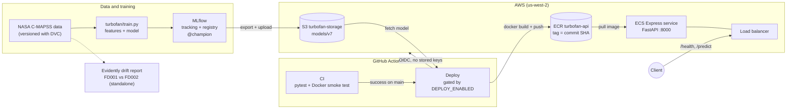

# Architecture

```mermaid
flowchart LR
    subgraph Data["Data and training"]
        raw["NASA C-MAPSS data<br/>(versioned with DVC)"]
        train["turbofan/train.py<br/>features + model"]
        mlflow["MLflow<br/>tracking + registry<br/>@champion"]
        raw --> train --> mlflow
    end

    subgraph CI["GitHub Actions"]
        ci["CI<br/>pytest + Docker smoke test"]
        deploy["Deploy<br/>gated by DEPLOY_ENABLED"]
        ci -->|"success on main"| deploy
    end

    subgraph AWS["AWS (us-west-2)"]
        s3[("S3 turbofan-storage<br/>models/v7")]
        ecr[("ECR turbofan-api<br/>tag = commit SHA")]
        ecs["ECS Express service<br/>FastAPI :8000"]
        alb["Load balancer"]
        ecs --- alb
    end

    mlflow -->|"export + upload"| s3
    deploy -->|"OIDC, no stored keys"| AWS
    s3 -->|"fetch model"| deploy
    deploy -->|"docker build + push"| ecr
    ecr -->|"pull image"| ecs

    user(("Client")) -->|"/health, /predict"| alb

    drift["Evidently drift report<br/>FD001 vs FD002 (standalone)"]
    raw -.-> drift
```